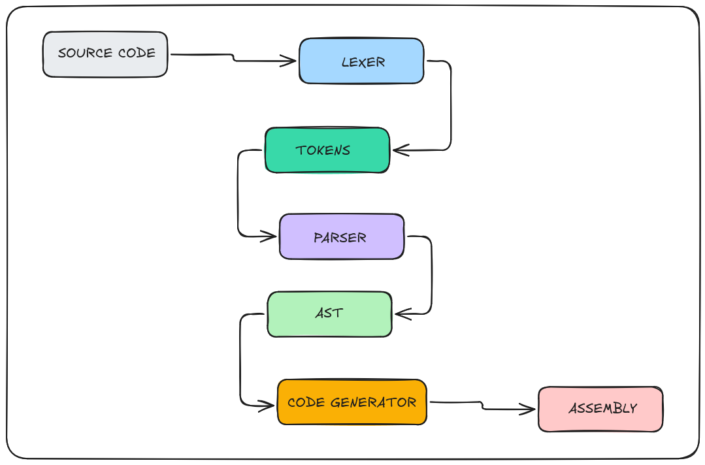

# TinyCC - A Toy C Compiler

**TinyCC (Tiny C Compiler)** is minimal, educational C compiler that compiles a subset of C to x86-64 Intel assembly.

## Architecture

The compiler follows a traditional three-phase pipeline:



1. **Lexer** (`lexer.c`): Reads source code character-by-character and produces tokens
2. **Parser** (`parser.c`): Uses recursive descent parsing to build an Abstract Syntax Tree (AST)
3. **Code Generator** (`codegen.c`): Traverses the AST and emits x86-64 Intel syntax assembly

## Features

- **Integer type** - Only `int` is supported
- **Function declarations** - Single function compilation
- **Local variables** - Stored on the stack
- **Arithmetic expressions** - Addition, subtraction, multiplication, division
- **Unary operators** - Negation (`-`), logical NOT (`!`), bitwise NOT (`~`)
- **Assignment** - Variable assignment with optional initializer
- **Return statements** - Function return values
- **Conditionals** - `if`, `else` statements with nesting

## Project Structure

```
tinycc/
├── include/          # Header files
│   ├── ast.h         # AST node definitions
│   ├── codegen.h     # Code generation interface
│   ├── lexer.h       # Lexer interface
│   ├── parser.h      # Parser interface
│   └── token.h       # Token definitions
├── src/              # Source files
│   ├── ast.c         # AST node implementation
│   ├── codegen.c     # x86-64 assembly generation
│   ├── lexer.c       # Tokenization
│   ├── main.c        # Compiler entry point
│   ├── parser.c      # Recursive descent parser
│   └── token.c       # Token utilities
├── Makefile
└── README.md
```

## Prerequisites

- **GCC**
- **GNU Make**

## Building

```bash
make
```

This produces the compiler at `bin/tinycc`.

## Usage

```bash
./bin/tinycc <source_file.c>
```

The compiler outputs `assembly.s` in the current directory.

## Building the Assembly

To assemble and link into an executable:

```bash
make build
# Run the compiled program
./out
```

## Supported Syntax

| Category     | Syntax                                       |
| ------------ | -------------------------------------------- |
| Variables    | `int x;`, `int x = 5;`                       |
| Assignment   | `x = 5 + 3;`                                 |
| Arithmetic   | `+`, `-`, `*`, `/`                           |
| Unary        | `-x`, `!x`, `~x`                             |
| Control      | `return <expr>;`                             |
| Conditionals | `if (expr) stmt`, `if (expr) stmt else stmt` |
| Blocks       | `{ ... }`                                    |

## Limitations

- Single function compilation only
- Integer type only (no floats, no strings)
- No function calls, no loops
- No global variables
- No arrays or structs

<p align="center">
    <strong>If you liked this project, consider giving it a ⭐.</strong>
</p>
